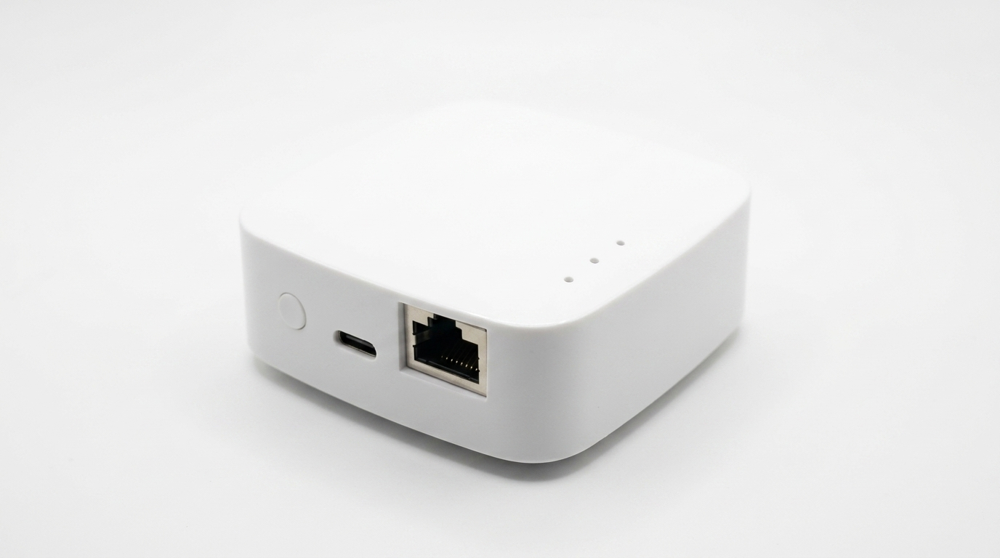
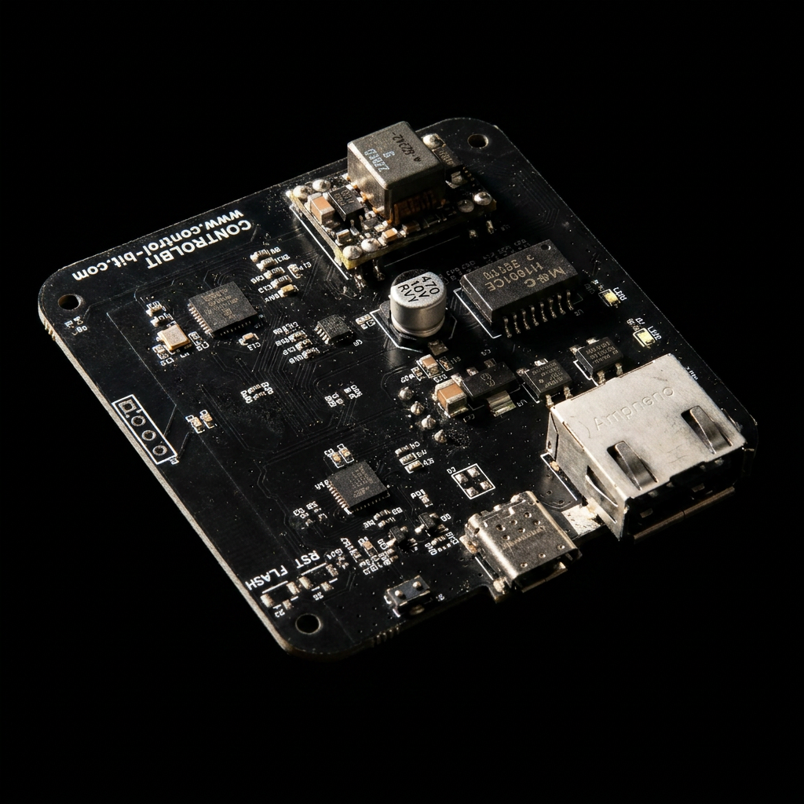
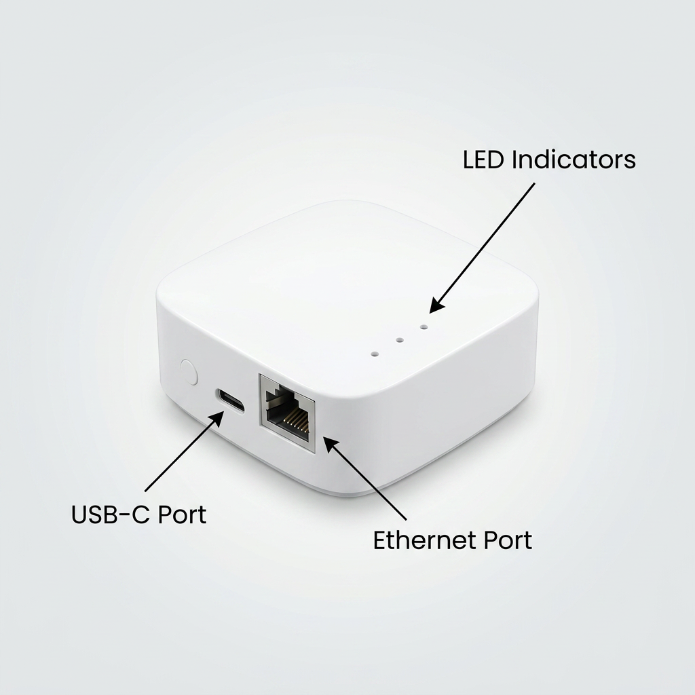
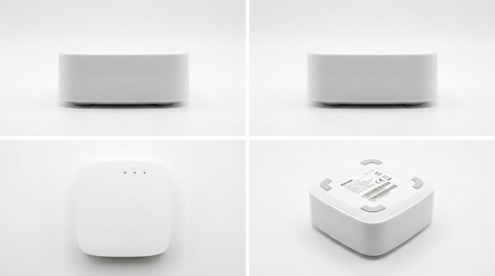

# 장치 사양 · BLE 게이트웨이

주변의 BLE 광고 패킷을 수신해 MQTT로 전달하는 실내 설치형 BLE 스캔 게이트웨이입니다.
iBeacon · Eddystone 등 BLE 태그의 광고를 수신 · 필터링해 JSON으로 변환하고, 유선 LAN 또는 Wi-Fi를 통해 MQTT 브로커로 전송합니다.
천장 · 벽면 부착형 케이스로 자산 추적, 출입 감지, 센서 태그 수집 등 BLE 기반 위치 · 모니터링 시스템의 수신 인프라로 사용합니다.
스캔 필터 · 페이로드 포맷 · 업링크 프로토콜 등 기능을 고객 요구에 맞게 커스터마이징할 수 있는 B2B 제품입니다.
엔지니어링 레벨의 핀맵 · 타이밍 · 프로토콜은 별도 기술 문서를 참조하세요.

| 외관 (조립 상태) | PCB 단품 | 케이스 내부 | 후면 브라켓 |
| --- | --- | --- | --- |
|  |  |  |  |
| 케이스 + 후면 브라켓 포함 | RJ45 · USB-C · LED 위치 확인 가능 | 케이스 내 PCB 장착 상태 | 천장 · 벽 부착용 브라켓 |

---

## 1. 기본 기능

| 항목 | 값 |
| ---- | ---- |
| 역할 | BLE 광고 패킷 수신 → MQTT 전달 게이트웨이 |
| BLE | BLE 5.0 (ESP32-S3 내장), 2.4 GHz, 수신 전용 스캔 기본 |
| 스캔 대상 | iBeacon · Eddystone · 제조사 지정 광고 포맷 (펌웨어 필터 설정) |
| 동시 처리 태그 수 | 목표 100대 이상 (필터 · 광고 주기 조건에 따름, 실측 후 확정) |
| 업링크 | MQTT publish (JSON), 유선 LAN 또는 Wi-Fi 선택 |
| 중복 제거 | MAC 기준 dedup 윈도우 설정 가능 (기본 1초) |
| 공급 형태 | B2B — 스캔 필터 · 데이터 포맷 · 연동 방식 등 펌웨어 커스터마이징 지원 |

> 처리 용량은 광고 밀도 · RSSI 필터 · 페이로드 크기에 따라 달라집니다. 수치는 실측 검증 전 목표값입니다.

---

## 2. 외관 / 기구

| 항목 | 값 |
| ---- | ---- |
| PCB | 전용 보드 v1.2 (ESP32-S3 기반) |
| 케이스 재질 | 플라스틱 |
| 마운팅 | 후면 브라켓 (천장/벽 부착) |
| 상태 표시 | LED 3개 (전원 · 네트워크 · BLE 수신) |
| 사용자 입력 | 없음 (설정은 웹 폼 · USB 시리얼로 대체) |

---

## 3. 전원

| 항목 | 값 |
| ---- | ---- |
| 전원 입력 | 2가지 지원 — ① USB-C (DC 5 V) ② PoE (RJ45) |
| USB-C | DC 5 V, 권장 어댑터 5 V / 1 A 이상 |
| PoE | IEEE 802.3af (AG9905M 모듈) |
| 코어 전압 | 3.3 V (보드 내 LDO) |
| 소비 전류 | TBD (실측 후 확정) |

---

## 4. 무선 / 네트워크

| 인터페이스 | 사양 |
| ---- | ---- |
| BLE | 2.4 GHz, 스캔 채널 37/38/39, 스캔 윈도우/인터벌 설정 가능 |
| Wi-Fi | 2.4 GHz b/g/n. STA (MQTT · OTA) + AP (설정 모드) |
| 유선 LAN | 10BASE-T (RJ45, ENC28J60), 설정으로 활성화 |
| MQTT | 외부 브로커 publish, 인증 옵션, 평문 / 사설 브로커 권장 |

데이터 송신 경로는 유선 LAN 또는 Wi-Fi 중 선택.
펌웨어 업데이트(OTA)는 Wi-Fi 경유 (HTTPS 다운로드).

> BLE 스캔과 Wi-Fi는 동일 2.4 GHz 라디오를 시분할 공유합니다. Wi-Fi 업링크 사용 시 스캔 듀티가 줄어 수신율이 저하될 수 있습니다. 고밀도 환경은 유선 LAN 업링크를 권장합니다.

---

## 5. 인터페이스

| 항목 | 값 |
| ---- | ---- |
| 디스플레이 | 없음 (LED 3개 + 시리얼 로그로 상태 표시) |
| 사용자 입력 | 없음 |
| PC 연결 | USB-C (CDC 시리얼, 설정/디버깅용) |
| 외부 네트워크 | RJ45, Wi-Fi 안테나 내장 |

---

## 6. 동작 환경

| 항목 | 값 |
| ---- | ---- |
| 동작 온도 | 0 ~ 40 °C (실내 사용 권장) |
| 보관 온도 | -20 ~ 60 °C |
| 습도 | 10 ~ 80 % RH (결로 없을 것) |
| 설치 환경 | 실내 전용. 직사광선 · 고온 · 습기 직접 노출 피할 것 |

---

## 7. 박스 구성

- 게이트웨이 본체 (케이스 조립 상태)
- 후면 브라켓
- USB-C 어댑터 (모델에 따라 옵션)
- 빠른 시작 안내문

---

## 8. 운영 / 관리

| 항목 | 값 |
| ---- | ---- |
| 설정 방법 | Wi-Fi AP + 웹 폼 / USB 시리얼 메뉴 |
| 장치 식별자 | 웹 폼 또는 시리얼로 설정, NVS 저장 (DIP 스위치 미사용) |
| 펌웨어 업데이트 | OTA (Wi-Fi 경유) |
| 진단 출력 | USB 시리얼 로그 + LED |
| 공장 초기화 | 시리얼 명령 (별도 절차 문서화 예정) |

BOOT/EN 버튼이 없으므로 공장 펌웨어 굽기는 CP2102 자동 다운로드 회로(DTR/RTS)를 사용합니다.

---

## 9. 인증 / 규격

| 항목 | 값 |
| ---- | ---- |
| 무선 인증 | KC (예정, BLE + Wi-Fi) |
| RoHS | (예정) |
| 사용 주파수 대역 | 2.4 GHz (BLE · Wi-Fi) |
